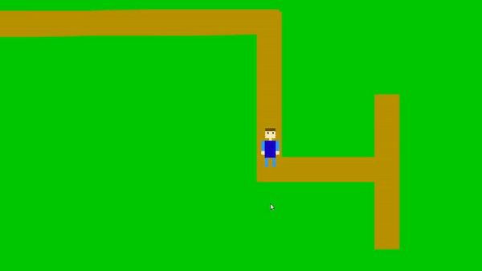

# 2D Character controller for RPG in Unity

This is a simple character controller you can use to move your characters in a 2D RPG game. 

## How to use this 
Just use animator controller to animate your character and add two parameters `MoveX` and `MoveY` to your transitions.

## Required Packages
The new Unity Input system is required to use this version of the asset
Just install the Input system package from the package manager, and switch your input system to the new system you just installed
After that, everything should work as expected

It is recommended that you use URP for your project, as the materials are already set up for URP

## Demo

